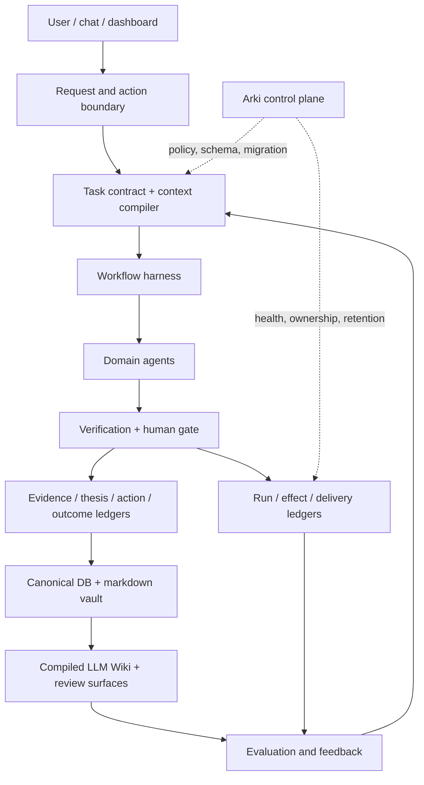

# Thesis OS System Whitepaper

Public edition. Updated 2026-08-30 from the canonical Thesis OS whitepaper
v2.5.0 and the current public-core boundary.

This document describes the reusable architecture. It excludes private
portfolio data, raw conversations, credentials, channel identifiers, exact
production schedules, and private repository topology.

## Definition

Thesis OS is a human-governed decision operating system for public-market
research, private-company research, and adjacent personal context. It turns
sources into evidence, evidence into theses, theses into explicit actions and
predictions, and outcomes into process improvements.

It is not an autonomous trading system, an alpha guarantee, or a replacement
for the person who owns capital and final decisions.

## Operating Principles

1. **Evidence first.** Facts, assumptions, interpretations, and actions remain
   distinct objects.
2. **Deterministic before LLM.** Code owns arithmetic, schemas, identity,
   paths, freshness, deduplication, permissions, and state transitions. Models
   own synthesis, causal interpretation, counterarguments, and prose.
3. **Thesis-centered.** Reports are evidence-bearing inputs. The durable object
   is the living thesis with assumptions, invalidation conditions, and action
   gates.
4. **Mental models above theses.** Reusable question sets, required data,
   disconfirming evidence, and action gates keep judgment from collapsing into
   one attractive narrative.
5. **Compiled knowledge.** The wiki is a generated retrieval view over
   canonical records, not a second source of truth or a raw-document dump.
6. **Bounded discretion.** Agents can reason freely inside explicit task,
   context, tool, and effect boundaries.
7. **Human authority.** Capital allocation, irreversible external effects, and
   policy changes remain under human control.
8. **Low noise.** A workflow earns its place by changing a decision, closing a
   fact gap, preventing an error, or improving a measured process.

## Architecture



The architecture separates three planes:

| Plane | Owns | Does not own |
|---|---|---|
| Data plane | source capture, normalization, evidence, freshness | final investment judgment |
| Judgment plane | theses, counterarguments, action gates, predictions | credentials, scheduling, canonical paths |
| Control plane | contracts, permissions, routing, ledgers, health, retention | investment calls |

## Decision Objects And Ledgers

```text
source event
  -> fact/evidence
  -> thesis and counter-thesis
  -> action gate and prediction
  -> decision or explicit non-action
  -> outcome and feedback
  -> process, tool, and memory update
```

| Object | Required question |
|---|---|
| Source event | What arrived, when, and from where? |
| Fact / evidence | What is verified, how fresh is it, and what remains uncertain? |
| Thesis | What must be true, what supports it, and what invalidates it? |
| Action | What changes now, who owns it, and what blocks execution? |
| Prediction | What measurable result should appear by which native horizon? |
| Outcome / feedback | Was the process sound, what happened, and why did they differ? |
| Run | Which inputs, context, model, tools, artifacts, and checks produced this result? |
| Effect / delivery | What external change or message occurred, with which approval? |

The public core implements the central evidence, thesis, action, prediction,
feedback, screener, harness-validation, and dashboard objects. Full run,
effect, delivery, and private-data ledgers are deployment extensions until they
are exposed as stable public contracts.

## Operating Roles

Five durable roles can share this object model:

| Role | Responsibility | Boundary |
|---|---|---|
| Alpha | data, source verification, screeners, evidence packets | no final capital-allocation decision |
| Lattice / 격자 | public-market thesis, red team, action and prediction | cannot bypass evidence or human capital authority |
| Gwajang / 과장 | private-company and VC thesis, diligence, monitoring | no public-market portfolio authority |
| Claw / 클로 | personal context, reflection, commitments | no investment or system-governance authority |
| Arki / 아키 | schemas, contracts, routing, runtime health, retention | no investment call |

The executable public CLI remains centered on Alpha, Lattice, and Arki. The VC
and reflection roles are documented extension patterns. See
[Operating Roles](operating-roles.md).

## Workflow Contract

A recurring or material workflow should enter through a bounded contract:

```yaml
workflow_id: stable-name
owner_agent: alpha | lattice | gwajang | claw | arki
objective: decision or operational outcome
input_refs: bounded sources with dates and digests
context_budget: file, section, character, token, and call limits
model_policy: primary, fallback, effort, maximum calls
tool_permissions: read, write, deliver, external-effect, approve
outputs: typed artifacts and canonical destinations
review_gates: deterministic, counterargument, human
failure_policy: retry, partial output, preserve-last-good, alert
outcome_checks: machine-verifiable completion and later value test
```

The declared workflow registry is the design authority. Cron, launchd,
systemd, CI, and persistent-agent schedules are runtime projections. A
projection may report health; it must not silently become a second schedule
authority.

## Context And Model Policy

Every task receives the smallest context packet that can support the decision.
Identity and hard boundaries stay available; detailed histories, manuals, and
large source sets load only when selected.

High-capability models belong at bounded synthesis and judgment gates. Code or
lower-cost models should handle collection, parsing, ranking, formatting, and
fallback. Expensive model calls do not belong inside unbounded loops.

Model failure must remain visible. A deterministic fallback may preserve
service, but it cannot masquerade as a completed high-confidence judgment.

## Knowledge And Memory

The durable knowledge path is:

```text
owner-domain source
  -> canonical structured object
  -> source-linked markdown note
  -> compiled wiki page
  -> retrieval event
  -> decision influence
  -> outcome and lesson
```

Compaction and summaries are projections. They require source pointers and
must not outrank the original evidence. Durable memory is promoted when it
changes a thesis, decision, risk, tool, or future retrieval behavior. Duplicate
raw captures and superseded generated views follow bounded retention.

Retrieval quality alone is insufficient. A mature deployment measures whether
retrieved knowledge influenced a decision, whether that influence helped, and
what should be replayed or retired.

## Permission And Effect Fences

The system classifies effects by reversibility and consequence:

| Effect | Default control |
|---|---|
| Read, calculate, validate | automatic within task scope |
| Reversible local write | automatic with provenance and rollback |
| Important but reversible publication | execute with notification or review |
| External message, capital action, confidential disclosure | prior human approval |
| Policy, permission, credential, destructive history change | explicit elevated approval and ledger |

Probabilistic judgment operates inside a deterministic permission and
verification shell.

## Evaluation

Thesis OS separates four questions:

1. **Process:** Was the judgment registered before the outcome and linked to
   current evidence?
2. **Result:** What happened at the thesis's native horizon?
3. **Influence:** Did the artifact change a decision, close a gap, or prevent an
   error?
4. **Operations:** Was the workflow reliable, timely, affordable, and quiet?

Activity counts are not value. File, message, token, and commit volume become
useful only when linked to decision use and outcomes.

## Public And Private Boundary

This repository publishes reusable schemas, code, contracts, examples, and
design documentation. A live deployment keeps these outside the public core:

- holdings, transactions, personal and company-confidential data;
- raw chat, email, browser, and social-session state;
- credentials, cookies, tokens, and OAuth material;
- private source licenses and paid raw feeds;
- exact channel identities, schedules, and internal repository topology.

Generated dashboards and wiki pages are review surfaces, not automatic public
artifacts. Publication requires a separate redaction and compliance gate.

## Maturity And Next Work

The public core demonstrates an auditable thesis-to-feedback loop. It does not
prove autonomous alpha. The next architecture milestones are:

1. make the task contract the executable entry point;
2. link each critical run from input digest to artifact, delivery, and outcome;
3. expose effect fences and action alignment as stable public contracts;
4. measure retrieval-to-decision influence, not retrieval quality alone;
5. retire low-value workflows and generated artifacts by evidence, not age or
   filename similarity alone.

See [Operating Maturity](operating-maturity.md), [Architecture](architecture.md),
and [Roadmap](../ROADMAP.md) for the public implementation boundary.
