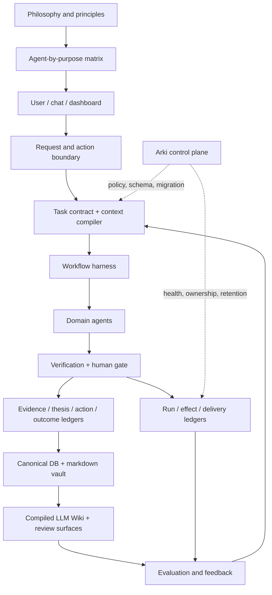

# Thesis OS System Whitepaper

Public edition. Updated 2026-09-08 from the canonical Thesis OS whitepaper
v3.1.4, preserving the public-core implementation boundary.

This document describes the reusable architecture. It excludes private
portfolio data, raw conversations, credentials, channel identifiers, exact
production schedules, and private repository topology.

## Definition

Thesis OS is a human-governed decision operating system for public-market
research, private-company research, and adjacent personal context. It turns
sources into evidence, evidence into theses, theses into explicit actions and
predictions, and outcomes into process improvements.

It is not an autonomous trading system, an alpha guarantee, or a replacement
for the person who owns capital and final decisions.

The user's ultimate outcomes are to maximize public-equity portfolio returns,
maximize VC-fund investment performance, and maintain balance in personal life
and relationships. Stronger judgment and lower cognitive burden support these
outcomes within existing risk, authority, and privacy boundaries. Operations follow one traceable hierarchy:
**philosophy and principles → agent-by-purpose matrix → individual work →
artifacts, effects, outcomes, and reviewed learning**.

## Operating Principles

The private VC runtime joins review questions to an explicit opportunity and
package binding. A prior judgment about the same company does not establish a
judgment for the current round. Changed source or answer hashes reopen operating
reviews, whose checkpoints retain the input revision, reviewer, evidence and next
review date. Checkpoints do not change deal stages or investment approvals.
Interim observations retain a follow-up date. Completed outcome reviews require
evidence and an explicit resolution with a lesson. Cooperating journal writers
share a lock, compare versions, replace files atomically and retain prior content.
Calibration admits only reviewed thesis resolutions with matching evidence hashes
and observation and recording dates available as of the evaluation date. These
integrations belong to the private runtime and do not imply production collectors
or investment workflows are shipped in public-core.

The private KR screening runtime carries input-quality state into candidate
outputs. Local OHLCV checks include missing universe prices, non-finite values,
duplicate bars, and corporate-action provenance. Assessments refresh after
successful collection and preserve earlier per-symbol quarantine during partial
refreshes. An assessment's date and latest-bar fingerprint bind it to the price
input it checked; this does not certify the entire price history. Unknown inputs
remain visible as research pending. Identical universe rows are deduplicated,
while conflicting metadata is exposed as an error in the KOSDAQ consumer.
Local price checks do not certify consensus freshness, official-source evidence,
or investment approval. These private-runtime integrations are architectural
examples, not claims that the public-core ships their production collectors.

The principle IDs match the canonical architecture; local investment rules and
private user context are not reproduced here.

1. **P1 — Life and judgment are the purpose.** Capital and performance support
   autonomy and responsibility. Health and relationships are not reduced to an investment score.
2. **P2 — Revise beliefs against reality.** Preserve alternatives, disconfirming
   evidence, time horizons, and the choice that would change.
3. **P3 — Separate facts, interpretation, and authority.** Reliable evidence
   does not itself authorize an external effect.
4. **P4 — Finish authorized work.** Carry bounded work through verification,
   canonical storage, and the delivery already authorized.
5. **P5 — Separate a thesis from a portfolio.** Business quality, expected
   returns at a price, position size, total risk, and opportunity cost are different questions.
6. **P6 — One meaning has one canonical authority.** Other views preserve
   ownership, provenance, and version links.
7. **P7 — Measure cost per useful result.** Use code for deterministic work
   and suitable models for judgment; include human rework in the comparison.
8. **P8 — Observe broadly and communicate useful change.** Collection breadth
   does not require repetitive messages or long reader-facing output.
9. **P9 — Memory is reviewable experience.** Distinguish user statements,
   observations, inferences, generated summaries, and approved principles.
10. **P10 — Evolution includes stopping and reversal.** Set acceptance,
    budgets, checkpoints, rollback, and conditions for consolidation or retirement.

## Architecture



The architecture separates three planes:

| Plane | Owns | Does not own |
|---|---|---|
| Data plane | source capture, normalization, evidence, freshness | final investment judgment |
| Judgment plane | theses, counterarguments, action gates, predictions | credentials, scheduling, canonical paths |
| Control plane | contracts, permissions, routing, ledgers, health, retention | investment calls |

## Decision Objects And Ledgers

```text
source event
  -> fact/evidence
  -> thesis and counter-thesis
  -> action gate and prediction
  -> decision or explicit non-action
  -> outcome and feedback
  -> process, tool, and memory update
```

| Object | Required question |
|---|---|
| Source event | What arrived, when, and from where? |
| Fact / evidence | What is verified, how fresh is it, and what remains uncertain? |
| Thesis | What must be true, what supports it, and what invalidates it? |
| Action | What changes now, who owns it, and what blocks execution? |
| Prediction | What measurable result should appear by which native horizon? |
| Outcome / feedback | Was the process sound, what happened, and why did they differ? |
| Run | Which inputs, context, model, tools, artifacts, and checks produced this result? |
| Effect / delivery | What external change or message occurred, with which approval? |

The public core implements the central evidence, thesis, action, prediction,
feedback, screener, harness-validation, and dashboard objects. Full run,
effect, delivery, and private-data ledgers are deployment extensions until they
are exposed as stable public contracts.

## Operating Roles

Five durable roles can share this object model:

| Role | Responsibility | Boundary |
|---|---|---|
| Alpha | data, source verification, screeners, evidence packets | no final capital-allocation decision |
| Lattice / 격자 | public-market thesis, red team, action and prediction | cannot bypass evidence or human capital authority |
| Gwajang / 과장 | private-company and VC thesis, diligence, monitoring | no public-market portfolio authority |
| Claw / 클로 | personal context, reflection, commitments | no investment or system-governance authority |
| Arki / 아키 | schemas, contracts, routing, runtime health, retention | no investment call |

The executable public CLI remains centered on Alpha, Lattice, and Arki. The VC
and reflection roles are documented extension patterns. See
[Operating Roles](operating-roles.md).

## Purpose-Based Operating Model

Purposes describe the result the system is accountable for. Tasks and workflows
are implementation units within a purpose. Each has one primary purpose;
collaboration, shared capabilities, and source reuse remain explicit supporting
relationships. This prevents double counting without pretending that work is independent.

| Purpose family | Components | Accountability |
|---|---|---|
| Public investing | screening and data; external intelligence; candidate decisions; strategy and risk; holdings monitoring; thesis and judgment loop; performance and execution review; investment principles | Alpha supplies evidence; Lattice owns investment judgment |
| VC and business | deal universe; pipeline; active diligence; research engine; business integration; thesis and judgment loop; technology and investment intelligence; portfolio, funds and exits | Gwajang, within organizational and human authority |
| Public knowledge | public-market publishing; VC publishing | Domain authoring owners with existing publication gates |
| Personal context | commitments; reflection and life balance; health context; personal asset context; relationships, communication and care | Claw; investment and organizational records retain their own owners |
| Shared foundations | storage and recovery; memory and wiki; recurring execution; message delivery and readability; profiles and harness; document SOP and artifact quality; architecture and change governance; shared skills and reusable assets; access and security | Arki, with domain collaborators |

Every active agent-purpose component defines four things:

| Contract field | Required definition |
|---|---|
| Purpose | The user question, judgment, or burden it serves |
| Goal | The outcome state to be achieved |
| Implementation | Existing tools, sources, records, workflows, gates, and handoffs |
| Measurement | Metric, unit, denominator, evidence, target or failure condition, and assessment method |

The matrix distinguishes accountability, execution, and collaboration. Purpose
accountability does not silently reassign an existing workflow, investment
decision, or permission. A task preserves its purpose ID, principle IDs, and
purpose-contract revision. Artifacts trace through task or workflow/run IDs to
that contract. An input-producing workflow and the task consuming its output may
serve different purposes; their relationship remains explicit.

Every purpose links to one or more ultimate outcomes. Portfolio performance
distinguishes cash flows, costs, returns, and risk. Fund performance distinguishes
realized distributions, unrealized valuations, losses, and capital allocation.
Personal and relationship balance is reviewed through the user's experience,
commitments, recovery, and perceived burden; it is not folded into one financial score.

Baseline validity also matters. Portfolio valuation snapshots do not establish
period returns without reconciled cash flows and valuation timing. Fund ratios
require a common paid-in, distribution, and NAV basis; reported hurdles are not
realized IRRs. Personal ratings require a dated user report and are not inferred
from generated reflections or task-overdue counts.

Automatic checks cover structural mapping, missing evidence, run freshness,
artifact integrity, and review age. Owners review actual output samples and
user usefulness. Execution success, file existence, and a complete catalog do
not certify purpose fulfillment. Unknown and legacy mappings remain visible.

Evidence follows the kind of work: services require availability observations,
collectors require data evidence, trackers require state links, and reports
require readable outputs. A file reference is resolved against the producing
workspace. Run timestamps are compared with their timezones. Technical review
and accountable-owner acceptance remain separate, and an observed successful
run returns an improvement to review rather than automatically closing it.

Native business tasks can retain purpose and principle IDs alongside existing
task records. Historical tasks are projected through explicit source relationships;
their bodies, completion status, and approvals are preserved. Missing identifiers
remain visible. Routine worker-model selection follows its declared worker
contract, independently of a conversation profile's default model.

New governed tasks require an explicit primary purpose or an unambiguous
workflow mapping before creation. Recurring producers pass the same purpose
contract. Historical requests can still reuse their original tasks. Reviewed
legacy records can receive missing identifiers and purpose metadata through a
previewed, locked, hash-checked update with a private backup. That repair preserves
business content and completion state; it does not certify that the work was done.

A judgment reader may refresh a stale current-state projection from an existing,
verified source snapshot and retry retrieval once. Source freshness limits still
apply. The derived page is replaced atomically, and an unavailable or stale source
continues to block judgment rather than allowing historical material to stand in.

A deployment can link existing judgment cohorts to source-bound follow-up cases.
Preserve the original decision identifier, source snapshot, purpose contract,
rationale, alternatives, falsifiers, and next review target. Track user decisions,
explicit execution links, outcomes, and lesson reviews separately. A later fill
in the same security is only a temporal candidate until its relationship to the
judgment is established. Do not infer non-execution from an empty observation.
Bind review closeout to the current evidence versions and reopen it when evidence
changes. Closing that review does not approve a trade or promote a thesis or memory.

The purpose catalog, task mapping, matrix projection, and recurring checks are
private deployment capabilities. This public repository documents the contract;
it does not claim to ship that complete deployment or its operational evidence.

## Workflow Contract

A recurring or material workflow should enter through a bounded contract:

```yaml
workflow_id: stable-name
owner_agent: alpha | lattice | gwajang | claw | arki
objective: decision or operational outcome
input_refs: bounded sources with dates and digests
context_budget: file, section, character, token, and call limits
model_policy: primary, fallback, effort, maximum calls
tool_permissions: read, write, deliver, external-effect, approve
outputs: typed artifacts and canonical destinations
purpose_id: one primary purpose from the deployment catalog
principle_ids: relevant philosophy references
purpose_contract_revision: reviewed contract digest
review_gates: deterministic, counterargument, human
failure_policy: retry, partial output, preserve-last-good, alert
outcome_checks: machine-verifiable completion and later value test
```

The declared workflow registry is the design authority. Cron, launchd,
systemd, CI, and persistent-agent schedules are runtime projections. A
projection may report health; it must not silently become a second schedule
authority.

## Context And Model Policy

Every task receives the smallest context packet that can support the decision.
Identity and hard boundaries stay available; detailed histories, manuals, and
large source sets load only when selected.

High-capability models belong at bounded synthesis and judgment gates. Code or
lower-cost models should handle collection, parsing, ranking, formatting, and
fallback. Expensive model calls do not belong inside unbounded loops.

Model failure must remain visible. A deterministic fallback may preserve
service, but it cannot masquerade as a completed high-confidence judgment.

## Knowledge And Memory

The durable knowledge path is:

```text
owner-domain source
  -> canonical structured object
  -> source-linked markdown note
  -> compiled wiki page
  -> retrieval event
  -> decision influence
  -> outcome and lesson
```

Compaction and summaries are projections. They require source pointers and
must not outrank the original evidence. Durable memory is promoted when it
changes a thesis, decision, risk, tool, or future retrieval behavior. Duplicate
raw captures and superseded generated views follow bounded retention.

Retrieval quality alone is insufficient. A mature deployment measures whether
retrieved knowledge influenced a decision, whether that influence helped, and
what should be replayed or retired.

## Permission And Effect Fences

The system classifies effects by reversibility and consequence:

| Effect | Default control |
|---|---|
| Read, calculate, validate | automatic within task scope |
| Reversible local write | automatic with provenance and rollback |
| Important but reversible publication | execute with notification or review |
| External message, capital action, confidential disclosure | prior human approval |
| Policy, permission, credential, destructive history change | explicit elevated approval and ledger |

Probabilistic judgment operates inside a deterministic permission and
verification shell.

## Evaluation

Thesis OS separates four questions:

1. **Process:** Was the judgment registered before the outcome and linked to
   current evidence?
2. **Result:** What happened at the thesis's native horizon?
3. **Influence:** Did the artifact change a decision, close a gap, or prevent an
   error?
4. **Operations:** Was the workflow reliable, timely, affordable, and quiet?

Activity counts are not value. File, message, token, and commit volume become
useful only when linked to decision use and outcomes.

Both public-market and VC thesis management own the complete judgment loop:
evidence → judgment and approval → observed effects and outcomes → reviewed
lessons and calibration → thesis revision. Performance measurement and research
engines supply that loop without becoming competing thesis authorities.

Message delivery is also a quality responsibility. A successfully delivered
message must help its reader identify what changed, why it matters, what to do
next, and where to verify it. Delivery receipts and reader comprehension are
separate measurements, including on narrow mobile screens.

The document SOP and production pipeline cover the reader's question, argument,
source verification, language editing, medium-specific production, actual
render review, final-file verification, delivery, and user corrections. A file
changed after review requires renewed verification. Slide and video evidence
must match their actual medium; a technical smoke test does not establish
presentation or listening quality.

Recent architecture changes strengthen source/fallback semantics, failure
propagation, work-to-memory provenance, delivery revisions, document release
evidence, and package-bound judgment calibration. These are engineering
capabilities. Future scheduled observations, real adoption, and investment
outcomes remain separate evidence requirements.

## Public And Private Boundary

This repository publishes reusable schemas, code, contracts, examples, and
design documentation. A live deployment keeps these outside the public core:

- holdings, transactions, personal and company-confidential data;
- raw chat, email, browser, and social-session state;
- credentials, cookies, tokens, and OAuth material;
- private source licenses and paid raw feeds;
- exact channel identities, schedules, and internal repository topology.

Generated dashboards and wiki pages are review surfaces, not automatic public
artifacts. Publication requires a separate redaction and compliance gate.

## Maturity And Next Work

The public core demonstrates an auditable thesis-to-feedback loop. It does not
prove autonomous alpha. The next architecture milestones are:

1. make the task contract the executable entry point;
2. link each critical run from input digest to artifact, delivery, and outcome;
3. expose effect fences and action alignment as stable public contracts;
4. measure retrieval-to-decision influence, not retrieval quality alone;
5. retire low-value workflows and generated artifacts by evidence, not age or
   filename similarity alone.

See [Operating Maturity](operating-maturity.md), [Architecture](architecture.md),
and [Roadmap](../ROADMAP.md) for the public implementation boundary.
